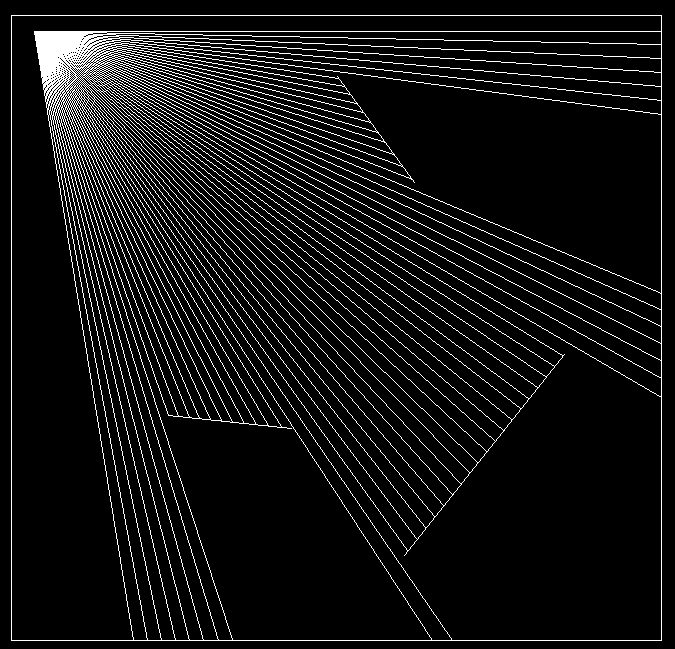
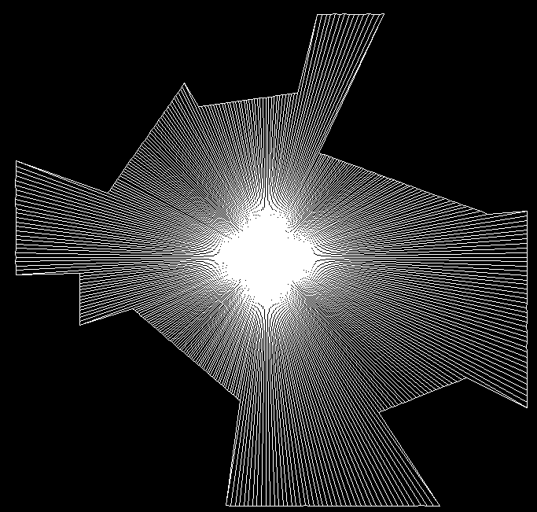

# Raycast Reflection Simulation

This project is an interactive 2D simulation of raycasting with reflection mechanics, built in **Java** using **Swing** for the graphical user interface (GUI). The project is set up using **Maven** and was developed in the **NetBeans IDE**. The rays originate from a movable light source and collide with predefined or user-drawn walls, reflecting off of them. The program allows you to dynamically control the raycasting parameters and draw custom walls to observe how light behaves in such a scenario, this program also allows you to view the polygon shape generated by the collision points of raycasts.

  

  

## Features

- **Raycasting:** Simulates multiple rays emitted from a movable light source in different directions.
- **Reflection:** Rays reflect off walls after collision if reflection mode is enabled.
- **Polygon Visualization:** View of the polygon generated by the raycast collisions.
- **Custom Wall Drawing:** Allows you to draw your own walls in the simulation.
- **Interactive Controls:** Modify the number of rays, angle range, and toggle reflection or drawing mode in real time.

## Controls

- **Mouse Movement:** 
  - Move the light source around by moving the mouse when drawing mode is off.
  - In drawing mode, see the preview of the wall you're drawing by moving the mouse.
  
- **Mouse Click:** 
  - In drawing mode, click once to set the starting point of a wall, and click again to set the endpoint of the wall.

- **Keyboard Controls:**
  - `Enter`: Toggle wall drawing mode.
  - `Backspace`: Delete the last user-drawn wall.
  - `Space`: Toggle reflection mode.
  - `Arrow Up`: Increase the number of rays (up to 360).
  - `Arrow Down`: Decrease the number of rays (down to 0).
  - `Arrow Left`: Rotate the rays counterclockwise.
  - `Arrow Right`: Rotate the rays clockwise.
  - `D`: Increase the light angle (field of view).
  - `A`: Decrease the light angle (field of view).
  - `H`: Toggle polygon mode.
  - `C`: Toggle color mode while in polygon mode.
